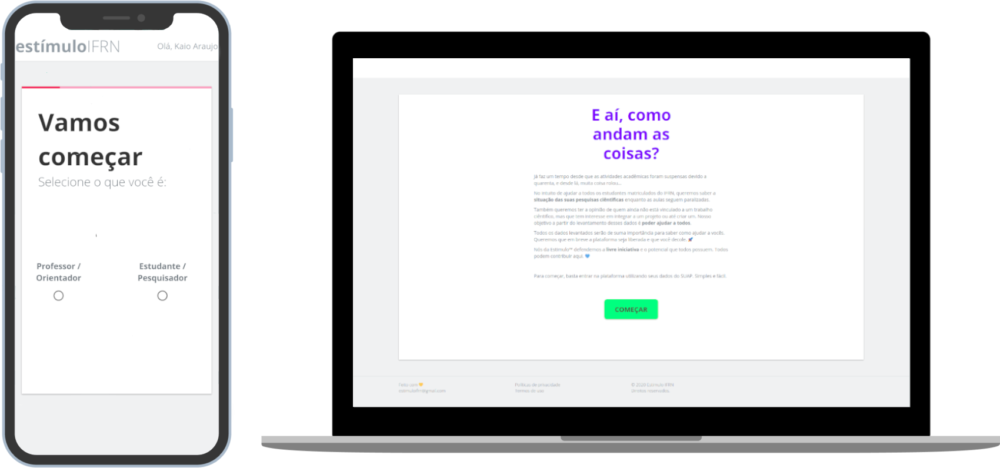

    <a href="https://estimulo.herokuapp.com/"><a/>

    <h1 align="center">Estimulo</h1>

<h4 align="center">
 Plataforma de livre iniciativa de projetos de pesquisa IFRN
</h4>

  

  
  
  

  

  

  

## :fire: Atenção
este é um protóptipo do projeto Estímulo. Será lançado até dia 8/06 sua fase inicial com um formulário com autenticação oauth2 da api do SUAP para levantamento de dados dos alunos e docentes, garantindo a pespectiva da situação dos projetos e melhorando na forma de como auxiliar os público alvo.

## 💻 Projeto

O Estimulo é um projeto que visa conectar estudantes e docentes da rede do IFRN com o âmbito de promoter a livre iniciativa a pesquisa ciêntifica nas mais diversas areas

## 🤔 Motivo/features

Devido a quarentena. Muitos projetos estão parados e sem continuidade pela inviabilidade dos seus integrantes não estarem presentes em seus campus. Estímulo garantirá a continuidade da ciência conectando alunos e orientadores, dando visiblidade aos projetos.

## :memo: Licença

Esse projeto está sob a licença MIT. Veja o arquivo [LICENSE](LICENSE.md) para mais detalhes.

## Autores

<table align="center">
  <tr >
    <td align="center"><a href="https://github.com/KZTN"> <b>Kaio César</b></a> <a href="https://github.com/kztn/Estimulo/commits?author=kztn" title="Code">💻</a> <a href="#kztn" title="Design">🎨</a></td>
  <tr>
</table>

## 

Feito com ♥ by KZTN

